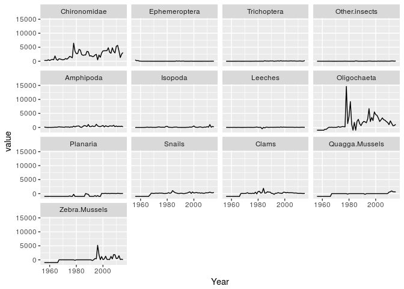

Interact with DataONE data repositories with the dataone package
================

The `dataone` package enables users to construct programmatic queries to DataONE data repositories. This should be very helpful for people interested in making their analyses reproducible! Here I show my workflow for locating, analyzing, and plotting Oneida Lake benthic invertebrate data all without leaving my RStudio session.

Setup
-----

Let's assume that I know that my target data is on [KNB](https://knb.ecoinformatics.org/) so I start by setting up `dataone` for a node specific KNB search:

``` r
library(dataone)

cn <- CNode("PROD")
mn <- getMNode(cn, "urn:node:KNB")
```

Find data id
------------

Let's also assume that, at least initially, I do not know the id of my target dataset. I only know that the dataset title should include the *benthic* and *Oneida* keywords. I choose to use the Solr method to query the database on the *Oneida* keyword and filter the results to entries containing the *benthic* keyword. I limit the result fields to *id*, *title*, and *dateModified*. For more explanation of the Solr query method see this [dataone vignette](https://github.com/DataONEorg/rdataone/blob/master/vignettes/searching-dataone.Rmd).

``` r
(qy <- dataone::query(cn, list(
                              rows = "300", 
                              q    = "title:*Oneida*",
                              fq   = "(title:*benthic*)",
                              fl   = "id,title,dateModified"), 
                     as = "data.frame"))
```

    ##                             id dateModified
    ## 1                 kgordon.4.51   2016-02-01
    ## 2                 kgordon.4.52   2016-09-01
    ## 3                 kgordon.4.56   2016-12-07
    ## 4                 kgordon.4.38   2016-02-01
    ## 5                 kgordon.4.37   2013-11-14
    ## 6  doi:10.5063/AA/kgordon.4.24   2015-01-05
    ## 7   doi:10.5063/AA/kgordon.4.9   2015-01-06
    ## 8   doi:10.5063/AA/kgordon.4.3   2015-01-06
    ## 9  doi:10.5063/AA/kgordon.4.34   2015-01-06
    ## 10  doi:10.5063/AA/kgordon.4.4   2015-01-06
    ##                                                                          title
    ## 1              Benthic invertebrates in Oneida Lake, New York, 1956-to present
    ## 2              Benthic invertebrates in Oneida Lake, New York, 1956 to present
    ## 3              Benthic invertebrates in Oneida Lake, New York, 1956 to present
    ## 4  Ekman sampling of benthic invertebrates in Oneida Lake, New York, 1964-2006
    ## 5  Ekman sampling of benthic invertebrates in Oneida Lake, New York, 1964-2006
    ## 6  Ekman sampling of benthic invertebrates in Oneida Lake, New York, 1964-2006
    ## 7       Eckman sampling of benthic invertebrates in Oneida Lake, NY, 1964-2006
    ## 8       Eckman sampling of benthic invertebrates in Lake Oneida, NY, 1964-2006
    ## 9  Ekman sampling of benthic invertebrates in Oneida Lake, New York, 1964-2006
    ## 10      Eckman sampling of benthic invertebrates in Oneida Lake, NY, 1964-2006

As far as I know, the results returned by a KNB website query include only the entries **not** prefixed by a doi designation. Let's filter our results to exclude the doi entries and sort on the *dateModified* field to find the most recent result version: :

``` r
library(dplyr)
(qy <- slice(qy, grep("^doi", id, invert = TRUE)))
```

    ##             id dateModified
    ## 1 kgordon.4.51   2016-02-01
    ## 2 kgordon.4.52   2016-09-01
    ## 3 kgordon.4.56   2016-12-07
    ## 4 kgordon.4.38   2016-02-01
    ## 5 kgordon.4.37   2013-11-14
    ## 6 kgordon.4.55   2016-09-01
    ## 7 kgordon.4.57   2016-12-07
    ##                                                                         title
    ## 1             Benthic invertebrates in Oneida Lake, New York, 1956-to present
    ## 2             Benthic invertebrates in Oneida Lake, New York, 1956 to present
    ## 3             Benthic invertebrates in Oneida Lake, New York, 1956 to present
    ## 4 Ekman sampling of benthic invertebrates in Oneida Lake, New York, 1964-2006
    ## 5 Ekman sampling of benthic invertebrates in Oneida Lake, New York, 1964-2006
    ## 6             Benthic invertebrates in Oneida Lake, New York, 1956 to present
    ## 7             Benthic invertebrates in Oneida Lake, New York, 1956 to present

``` r
(qy <- arrange(qy, desc(id), desc(dateModified)))
```

    ##             id dateModified
    ## 1 kgordon.4.57   2016-12-07
    ## 2 kgordon.4.56   2016-12-07
    ## 3 kgordon.4.55   2016-09-01
    ## 4 kgordon.4.52   2016-09-01
    ## 5 kgordon.4.51   2016-02-01
    ## 6 kgordon.4.38   2016-02-01
    ## 7 kgordon.4.37   2013-11-14
    ##                                                                         title
    ## 1             Benthic invertebrates in Oneida Lake, New York, 1956 to present
    ## 2             Benthic invertebrates in Oneida Lake, New York, 1956 to present
    ## 3             Benthic invertebrates in Oneida Lake, New York, 1956 to present
    ## 4             Benthic invertebrates in Oneida Lake, New York, 1956 to present
    ## 5             Benthic invertebrates in Oneida Lake, New York, 1956-to present
    ## 6 Ekman sampling of benthic invertebrates in Oneida Lake, New York, 1964-2006
    ## 7 Ekman sampling of benthic invertebrates in Oneida Lake, New York, 1964-2006

Get data package
----------------

Next, I download the data package with the `getPackage` command. This command returns the location of a zip file in the machine's temporary file system which can be fed to the `unzip` function.

``` r
resource_path <- paste0("resourceMap_", qy[1,"id"])
dt <- getPackage(mn, id = resource_path)
unzip(dt)
```

``` r
# the unzipped folder has underscores as separators rather than periods
package_path <- file.path(gsub("\\.", "_", resource_path), "data")
```

``` r
(flist <- list.files(package_path))
```

    ## [1] "cbfs.140.3-Oneida_Benthos_1956_to_present.csv.csv"
    ## [2] "cbfs.141.3-Taxa_list_Oneida_Benthos.csv.csv"      
    ## [3] "cbfs.27.8-Benthos_locations.csv.csv"              
    ## [4] "kgordon.4.57-METADATA.pdf"                        
    ## [5] "kgordon.4.57-METADATA.xml"                        
    ## [6] "resourceMap_kgordon.4.57-RESOURCE.rdf"

``` r
fpath <- file.path(package_path, flist[1])
dt <- read.csv(fpath, stringsAsFactors = FALSE)
head(dt)
```

    ##   Year DepthGroup Season X.SamplingEvents Chironomidae Ephemeroptera
    ## 1 1957       deep Spring                1        359.9         121.7
    ## 2 1958       deep Spring                1         34.3         500.0
    ## 3 1959       deep Spring                1        822.7          34.8
    ## 4 1962       deep Spring                4        939.8           0.0
    ## 5 1963       deep Spring                2        454.2           0.0
    ## 6 1965       deep Spring                2       1782.5           0.0
    ##   Trichoptera Other.insects Amphipoda Isopoda Leeches Oligochaeta Planaria
    ## 1         0.0          17.4       8.7     0.0     0.0      -999.0     -999
    ## 2         0.0           0.0       0.0     0.0     0.0      -999.0     -999
    ## 3         0.0           0.0       0.0     0.0     0.0      -999.0     -999
    ## 4         0.0           6.5       0.0     0.0    39.1      -999.0     -999
    ## 5         0.0           0.0      52.2     0.0     0.0         4.3     -999
    ## 6         4.3           0.0       8.7    69.6    13.0        21.7     -999
    ##   Snails Clams Quagga.Mussels Zebra.Mussels
    ## 1   -999  -999           -999          -999
    ## 2   -999  -999           -999          -999
    ## 3   -999  -999           -999          -999
    ## 4   -999  -999           -999          -999
    ## 5   -999  -999           -999          -999
    ## 6   -999  -999           -999          -999

Plot data
---------

Now that I have the dataset located, downloaded, and read into a `data.frame` object I go ahead and plot the result while facetting on organism class.

``` r
library(dplyr)
library(ggplot2)

dt <- group_by(dt, Year)
dt <- summarise_each(dt, funs(mean), 5:17)
dt <- reshape2::melt(dt, "Year")

gg <- ggplot(data = dt) + 
        geom_line(aes(x = Year, y = value)) + 
        facet_wrap(~variable)
gg
```


